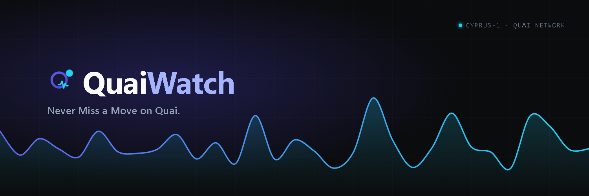

<div align="center">



# QuaiWatch

**Never Miss a Move on Quai.**

Free, open-source analytics dashboard for [Quai Network](https://qu.ai).

[**Live → quaiwatch.pages.dev**](https://quaiwatch.pages.dev) · [X](https://x.com/QuaiWatch)

</div>

---

QuaiWatch tracks network stats, wallet balances, token holdings, and live
on-chain activity — built entirely on public Quai RPC and Quaiscan data. No
ads, no tracking, no paid APIs.

## Features

- **Network stats** — block height, TPS, gas price, total addresses &
  transactions, network utilization.
- **QUAI price chart** — historical price (7D / 30D / 90D / 1Y) from CoinGecko.
- **QUAI & Qi prices** — QUAI from CoinGecko; Qi derived on-chain from the
  protocol's own `quai_qiToQuai` conversion rate, since Qi isn't listed on any
  market data provider.
- **Wallet explorer** — search any address for its QUAI balance, all QRC-20
  token holdings, and full transaction history.
- **Live transaction feed** — recent transactions with type filters
  (native / contract / coinbase).
- **Token discovery** — every QRC-20 token on the network with holders and
  supply.
- **Rich list** — top native QUAI holders.
- **Dark / light mode.**

## Roadmap

QuaiWatch ships in phases — currently **v2.0** (Phase 2 complete). See
[ROADMAP.md](ROADMAP.md) for the full plan.

## Technical notes

- **Chain**: Quai Network, chain ID `9`. The only active zone today is
  **Cyprus-1** (`quai_listRunningChains → [[0,0]]`). The data layer is
  multi-zone-ready in `src/lib/config.ts`.
- **RPC**: `https://rpc.quai.network/cyprus1` — the `quai_` namespace, not
  `eth_`. CORS is open, so the frontend calls it directly with no backend.
- **Qi decimals**: Qi uses **3 decimals**, not 18 like QUAI. This is defined in
  the `quais` SDK (`formatQi`) rather than the docs — assume 18 and every Qi
  amount is off by 10^15. See `src/lib/quai.ts`.
- **QRC-20 prices**: Quaiscan returns no price data for tokens
  (`exchange_rate` is always null), and no free source exists. The UI shows
  token amounts without USD value.
- **`quais` SDK**: currently alpha (`1.0.0-alpha.56`). It's pinned to an exact
  version and isolated in `src/lib/quai.ts` so a breaking change only touches
  one file.
- **Live feed**: polls Quaiscan every 5s rather than using WebSocket. Block
  time is ~4s, so a few seconds of lag on a dashboard feed is negligible. A
  `WebSocketProvider` is available in `src/lib/quai.ts` for a future upgrade.

## Stack

- [Next.js](https://nextjs.org) (static export) → [Cloudflare Pages](https://pages.cloudflare.com)
- [`quais`](https://www.npmjs.com/package/quais) SDK (isolated in one file)
- [Tailwind CSS](https://tailwindcss.com)
- [Recharts](https://recharts.org) (reserved for upcoming charts)
- TypeScript

## Development

```bash
pnpm install
pnpm dev          # http://localhost:3000
pnpm build        # static export to ./out
pnpm typecheck
```

## Deploy

`output: "export"` produces a static `out/` folder, deployed to Cloudflare
Pages:

```bash
pnpm build
wrangler pages deploy out --project-name quaiwatch --branch master
```

## License

[MIT](LICENSE) © 2026 Ledger Vibes

## Disclaimer

Not financial advice. Not affiliated with Quai Network. All data comes from
public Quai RPC endpoints and Quaiscan.
